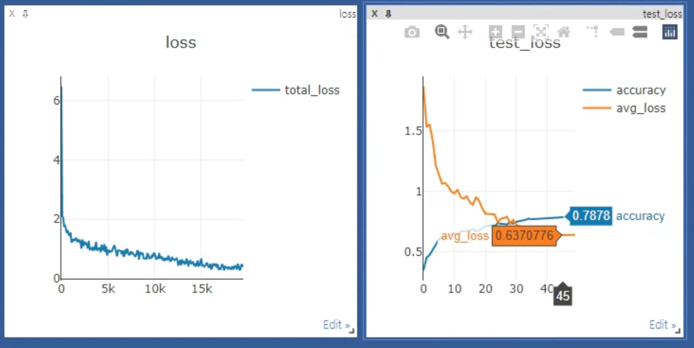

## What do the components of transformer do in vision transformer?

The goal of this repo is to find the analysis of various components of ViT (e.g. cls token, pos embedding..)

### Set training environment

- batch : 128
- lr : 1e-3
- epoch : 50

- optimizer : adam
- betas : (0.9, 0.999)
- weight_decay=5e-5

- lr scheduler : cosine scheduler
- loss : cross entropy
- model : Vit  [dim=384, mlp_dim=384, num_heads=12, num_layers=7,
                patch_size=8, image_size=32, is_cls_token=True,
                dropout_ratio=0.0, num_classes=10]
       
          
### Results of ablation study at cifar10  

| #   |Cls token   | Pos embedding     |  Dataset   | Patch size | Length of sequence |  # params      | Accuracy |Test loss | overfitting epoch  | Time | 
|-----|------------|-------------------| ---------- | ---------- | ------------------ |----------------|----------|----------| -------------------| -----|
|1    | O          |normal learning 1d |  CIFAR10   | 8 x 8      |  17 (= 4 X 4 + 1)  |6304906         |0.7554    |0.7702    | 35                 | s    |
|2    | X          |normal learning 1d |  CIFAR10   | 8 x 8      |  16                |6304138         |0.7701    |0.7054    | 37                 |      |
|3    | O          |normal learning 1d |  CIFAR10   | 4 x 4      |  65                |6268042         |0.7490    |0.7588    | 32                 |      | 
|4    | X          |normal learning 1d |  CIFAR10   | 4 x 4      |  64                |6267274         |0.7870    |0.6486    | 48                 | 10s  |  
|5    | X          |conv pos embedding |  CIFAR10   | 4 x 4      |  64                |6269258         |0.7933    |0.6268    | 39                 | s    |
|6    | X          |conv pos embedding |  CIFAR10   | 4 x 4      |  64                |6269258         |0.7907    |0.6268    | 49                 | s    |
|7    | X          |normal learning 1d |  CIFAR10   | 4 x 4      |  64                |5240458         |0.8445    |0.5170    | 34                 | 27s  | 

### comparison of 1d pos embedding with conv pos embedding (2022/6/25)

| #   |Cls token   | Pos embedding     |  Dataset   | Patch size | Length of sequence |  # params      | Accuracy |Test loss | overfitting epoch  | Time | 
|-----|------------|-------------------| ---------- | ---------- | ------------------ |----------------|----------|----------| -------------------| -----|
|1    | X          |normal learning 1d |  CIFAR10   | 4 x 4      |  64                |6267274         |0.7878    |0.6486    | 45                 | 9-10s|  
|1    | O          |normal learning 1d |  CIFAR10   | 4 x 4      |  64                |6267274         |0.7878    |0.6486    | 48                 | 10s  |  
|2    | O          |sinusoid pos embed |  CIFAR10   | 4 x 4      |  64                |                |0.7878    |0.6486    | 48                 | 10s  |  

